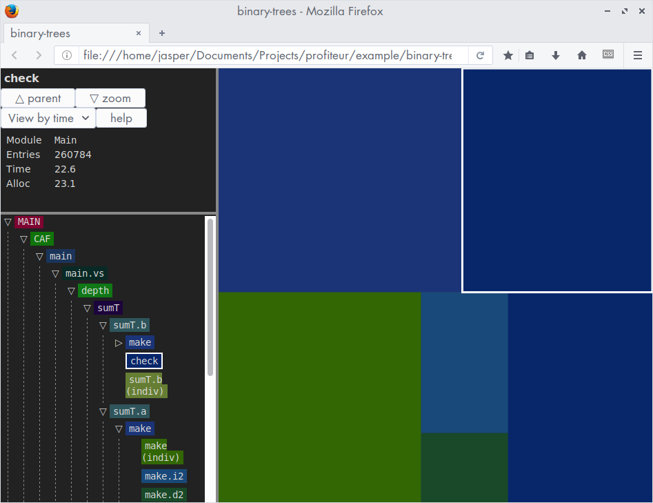

profiteur
=========

Profiteur is a visualiser for GHC `.prof` files.

Installation
------------

    cabal install profiteur

Usage
-----

    ghc --make -auto-all -prof your-program.hs
    ./your-program +RTS -p -RTS
    profiteur your-program.prof

Open the output, `your-program.prof.html`, in a web browser.

See also [example/Makefile](example/Makefile).

A tree browser and a tree map are available to browse the profile.

Expand cost centres by clicking the chevrons in the tree browser or
double-clicking them in the tree map.

